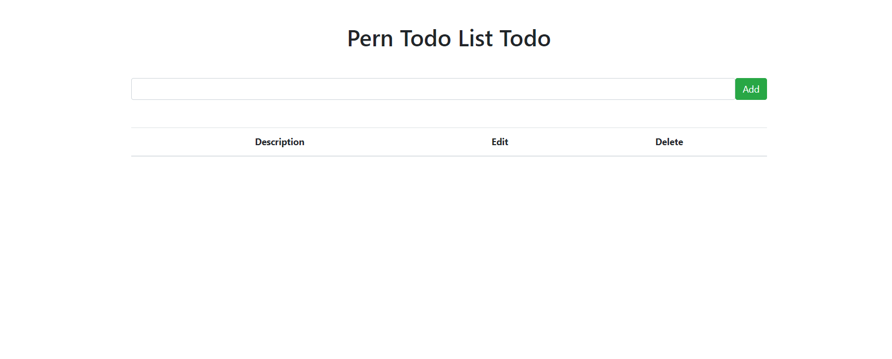
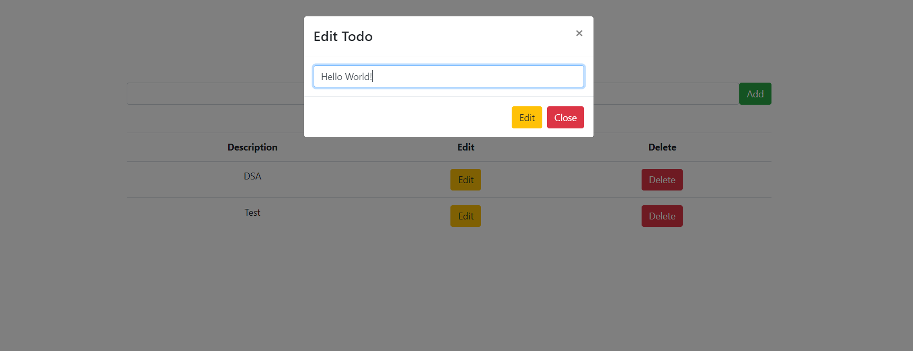

PERN Stack - Postgres, Express, React, and Node
===


## Use
- Install Dependencies
  ```
  npm install
  ```
- Run App
  ```
  npm start
  ```
## Technology Stack
 - cors
  - dotenv
  - express
  - pg


### Database
- Connect to Postgres
```sql
psql -U your_username -d postgres
```

- Create Database
```sql
CREATE DATABASE perntodo;
```

- Connect to the New Database
```sql
\c perntodo
```

- Create Table 
```sql
CREATE TABLE todo(
    todo_id SERIAL PRIMARY KEY,
    description VARCHAR(255)
);
```

<div align="center">
  
</div>


<div align="center">
  
</div>

